# Build Steps for Mini-V

> [!CAUTION]
> This build guide is a work-in-progress

## General Tips

- Use an ultra flat surface for assembly of frame
- Take a file or flattening stone to all mating surfaces, including all clips
- Panel clips should be snapped in diagonally towards the extrusion

## Gather Hardware

See [BOM](./docs/BOM) for Bill of Materials

## Print Parts

See [Printing Parts](./docs/PrintingParts)

## Heat Sets

- Grab some coffee, I hope you like putting in heat sets as there are many

> [!Tip]  
> You can build the left side of the printer, then the right side, or build them in parallel

## 🔁 Build left side

- Assemble 2 uprights and the bottom extrusion using blind joints M5x16 (2)
  - (optional) Bottom of bottom extrusion will need (2) T-nuts
  - You should have a U shape

  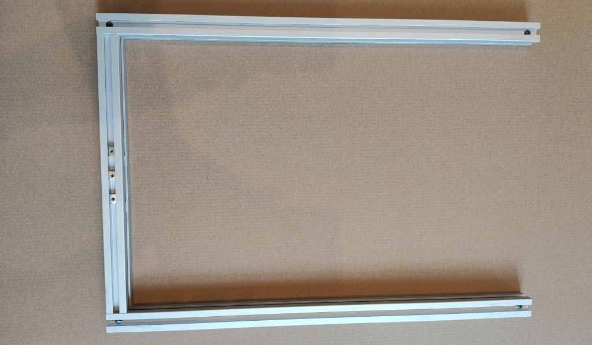

### Building Z0 axis

- Add the Z0 motor mount using a M3x30 (1) side and M3x8 (1) screw on top
  - Note: leave these screws slightly loose until the final frame tighten
- Loosely mount Z-rail clips using M3x10 (4)
  - Order from bottom up
    - bed_Front_Z_Rail_Mount, M3x10
    - panels_Clip
    - bed_Front_Z_Rail_Mount_B_Mount (lower), M3x10
    - panels_Clip
    - bed_Front_Z_Rail_Mount, M3x10
    - panels_Clip_Door_Hinge_Latch_Left, M3x8
    - bed_Front_Z_Rail_Mount_A_Mount (upper), M3x10

  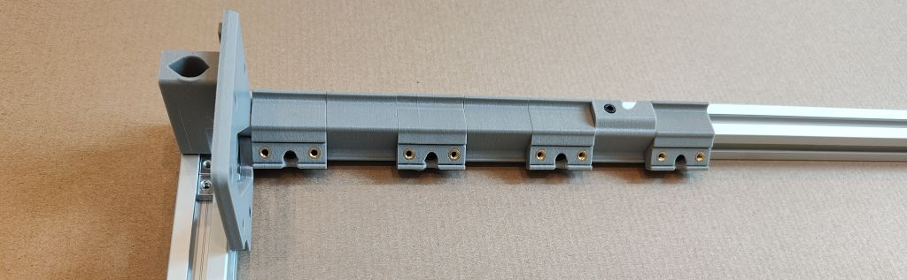

- Add the z-rail to clips using M3x6 (8)
  - Note: don't tighten down until all screws are in
  - Note: add your clip so carriage doesn't fall out when flipping upside down
- Tighten down Z-rail clips using ball end hex
  - Note: the top clip should line-up or you may need to adjust the clips

  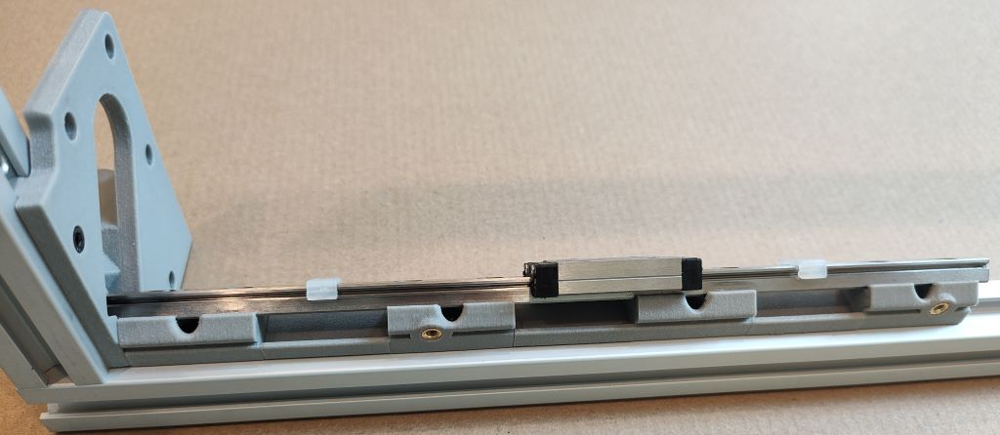

### Rear E-bay mount (low voltage)

- Note: leave these screws for the ebay mount loose until later, otherwise it might tweak the frame
- Add T-nuts to high-voltage ebay part using M3x10 (1) side middle and M3x6 (1) side top

  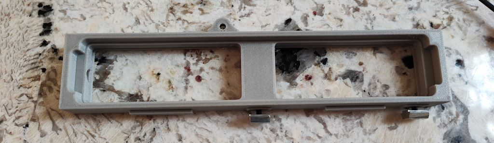

- Roll-in a bottom T-nut in position then slide on ebay part and fasten bottom with M3x8 (1)

### Y Rail mount

- Slide 269mm (2) steel rods into Y-rail mount (2)
  - Note: check the length is not longer than 270

  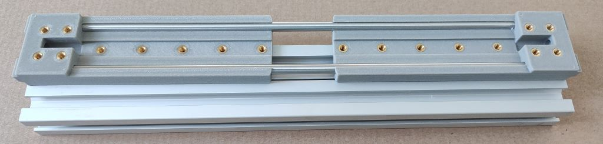

- Fasten the Y-rail using M3x6 (10) to get proper spacing
  - Note: your Y-rail needs to be cut precisely for this design
- Add T-nuts to each using M3x10 (2) then slide-in between extrusions

> [!CAUTION]
> The following steps requires precise measurements, so take your time

- Use calipers and set to 140mm from very top to top of mount
  - Note: you should see 245mm from lower extrusion to bottom of mount
  - TODO: Add diagram
- Tighten down Y-rail mount on both sides

  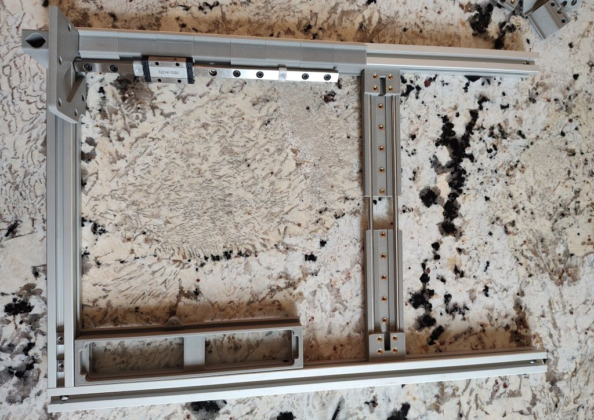

### Front and rear idlers

- Flatten mating surfaces and screw together front idler using M3x20 (1)
  - Screw front idler to front using M3x8 (4)

  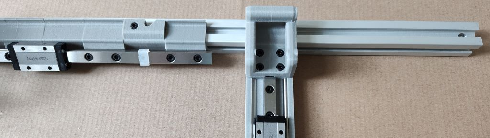

- Flatten mating surfaces and screw together the motor idler using M3x20 (2)
  - Screw motor idler to rear using M3x8 (4)

  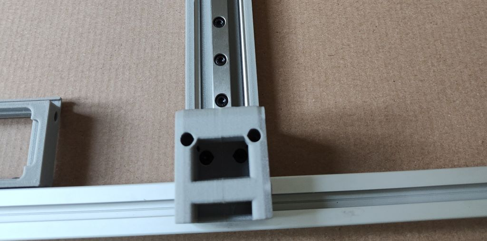

> [!IMPORTANT]  
> The front and rear idlers add rigidity by clamping around the extrusion

  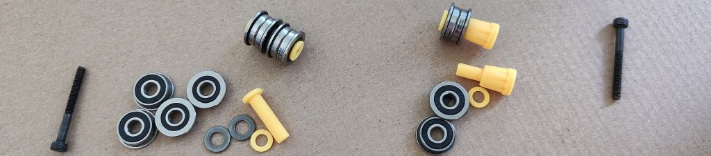

- Build a single stack bearing using F695 (2) and the plastic washer/clip should pop on the top

  - Add the single stack bearing using M3x30 (1) to the front idler

- Build a double stack bearing using F695 (4), M5 washers (2) and the plastic washer clip will pop on top keeping everything together

  - Add the double stack bearing using M3x30 to the rear motor idler back corner

- Assemble the guilder with the F623-RS (2) bearings in place and use M3x30 (1) screw
- Note: there is a mini plastic washer for the guilder

  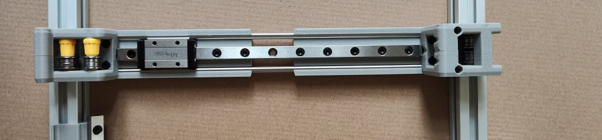

### XY Joint

- Flatten mating surfaces and screw together the XY Joint using M3x20 (1)
- Screw XY Joint onto Y Rail using M3x6 (4) FHCS
  - Note: you'll need a 2mm ball-end hex driver for the front two screws
- Build a single stack bearing using F695 (2) and the plastic washer/clip should pop on the top
  - Add the single stack bearing using M3x30 (1) to the front idler
  - Note: it should be in opposite orientation of other single stacks

  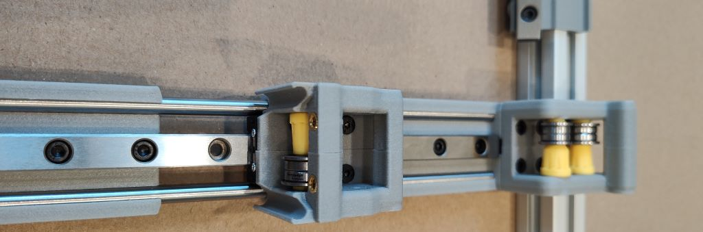

### Add top extrusion

- Add the top extrusion using the blind joints M5x16 (2)
  - (optional) Top extrusion will need (2) T-nuts

  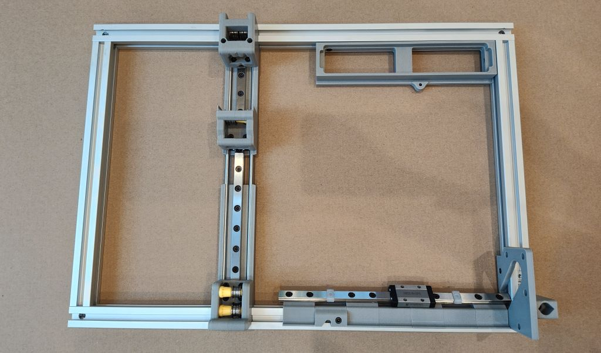

## 🔁 Build right side

- Repeat all left side steps but mirror everything (Z2 motor mount)

  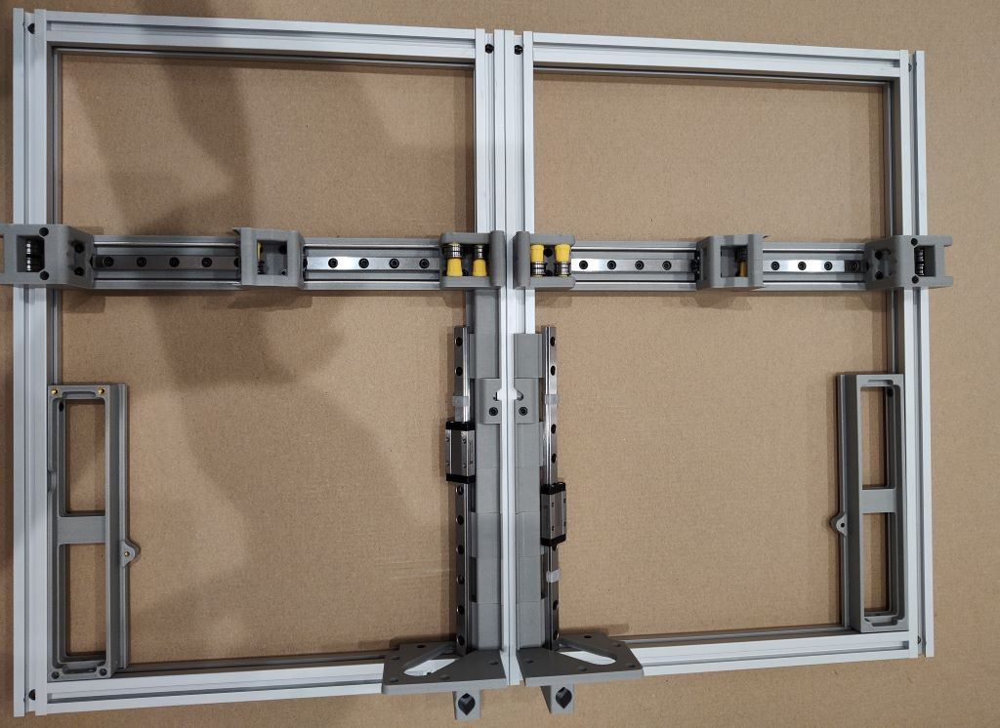

> [!CAUTION]
> There is a small error in the image above where right side has guilder in wrong spot

## Join sides and finish frame

- Slide motor mounts onto rear 279mm steel rods (2)
- Bring the two sides together by sliding rods into motor idler and on each side

  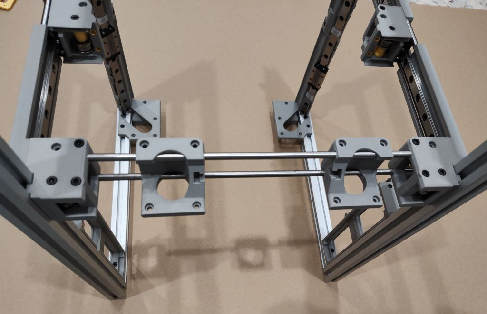

- Finish the frame on a flat surface using blind joints and M5x16 (8)
  - Note: ensure frame is square
  - Tighten all the screws you left loose
  - Congrats, it is starting to look like a printer

  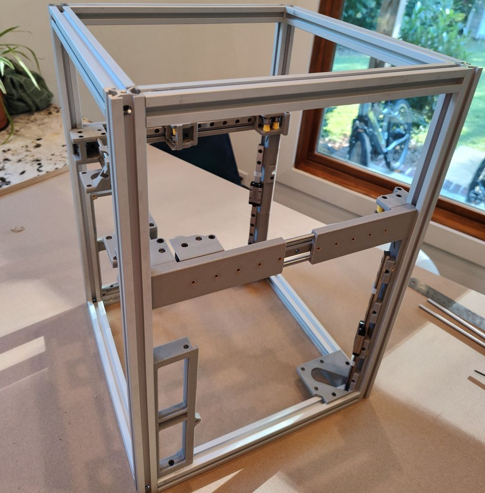
  

## Feet

- Add all four foot mounts using M3x6 (8) for LDO or M3x8 for taller foot mounts
- Each foot requires a M4 thumbscrew (4) and M3x16 (4) for LDO or M3x20 for taller foot mounts

  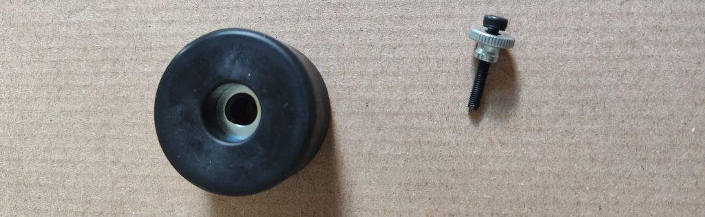

- There is an arc feature on the part to help you align each foot into the correct spot

  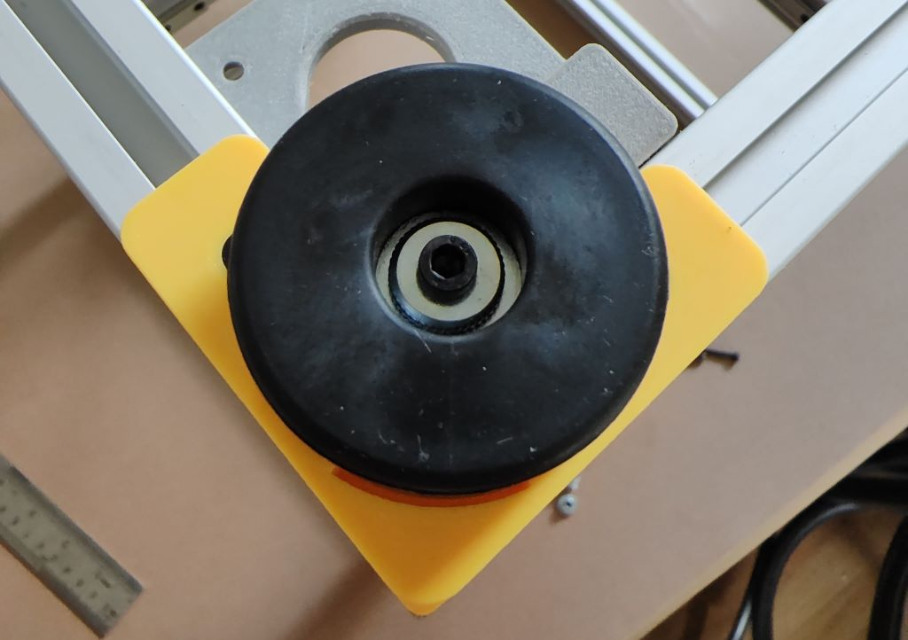

- Add the matching four top panel latches using M3x6 (8)

> [!Tip]  
> Your surface is now protected from scratches by your frame

## X-Rail

- Build the X-Rail backer using 280mm carbon rods (2)
- Mount the X-Rail (choose your best rail) using M3x8 (8)
  - Note: make sure you center things before screwing to the XY Joints

  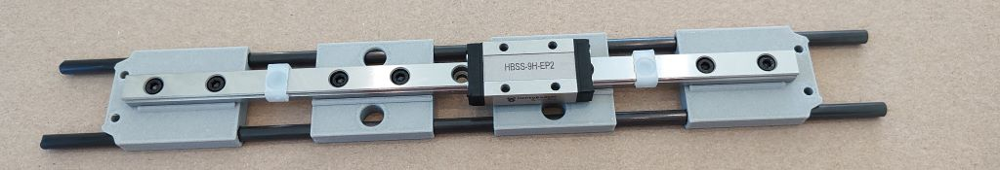

- Screw X-Rail Backer to XY-Joints using M3x8 (4)

  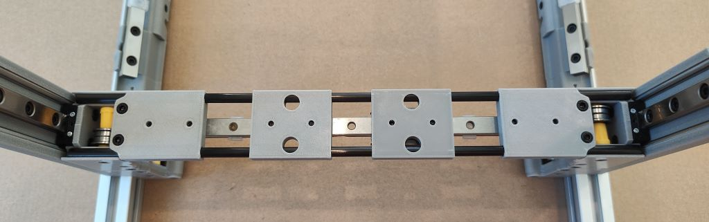

> [!Tip]  
> You can now test the gantry motion by hand and ensure it feels smooth

## Rear Z Motor Mount

- Note: Depending on printer tolerance, use a 5mm reamer on all the parts prior to joining them together
- Start with the Z1 motor mount and add the metal 280mm rods
  - Note: Don't forget to sand the mating edges to avoid gaps
- Here is the order top to bottom, you'll put bottom in first:
  - bed_Z1_Rail_Mount_top
  - bed_Z1_Rail_Mount
  - bed_Z1_Rail_Mount_Wire_Manage
  - bed_Z1_Rail_Mount
  - bed_Z1_Rail_Mount

  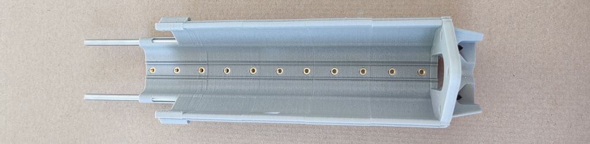

- Add the Z1 rail using M3x6 (11)

> [!Tip]
> Don't insert the top screw so you can leave the carriage safety clip in place

  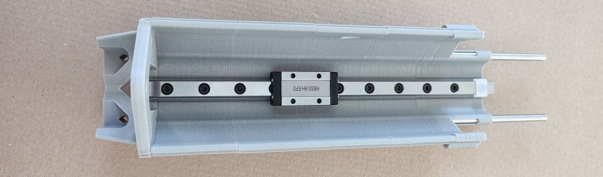

- Use M3x20 (2) for lower screws of the Z1 motor mount, leave loose
- Measure 135mm to center of rear screw from both side extrusions
- Use M3x6 (1) on the back and leave it loose too, you need to slide side to side to finalize the fit
- Install the E3EZ mount to the low voltage ebay mount using M3x8 (2)

  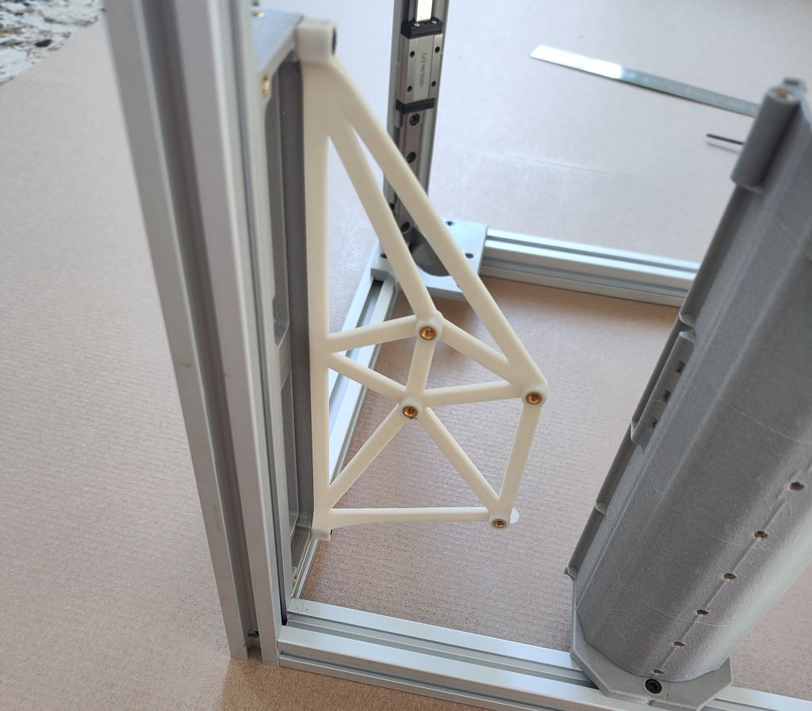

- Install the mid panels now help get the alignment of Z1
  - Except for the very bottom, the Z Rail Mounts should flex to allow you to pop in the mid panel
    - Start by pushing the panel into the inner flexible side as it should flex enough for you to clear the outer side
  - Note: this assumes your mid panels are accurately cut, otherwise use calipers to get it center

  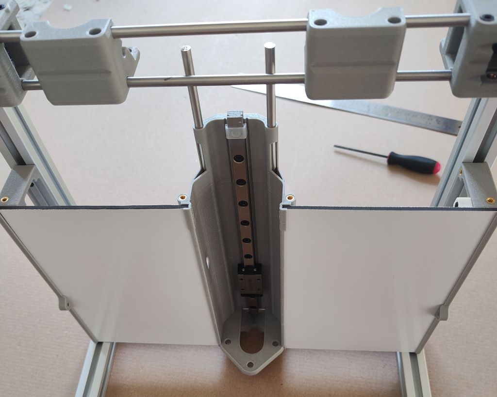

### Rear Z Motor Mount Clamp

- Add the tensioner knobs from behind into the back clamp using M5 nuts (2)
- Add your hex head M4x40 (2) into the back clamp to install the knobs
  - Note: orient the knob so the plastic side is on the outside

  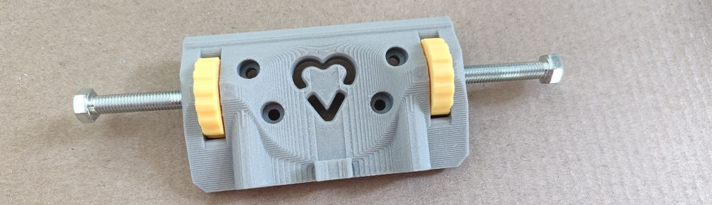

- Slide the clamp down over the vertical rods while passing the horizontal rods
  - Note: this part is tricky as you also need to line the hex head screws into motor mounts
- It should seat onto the horizontal rods

  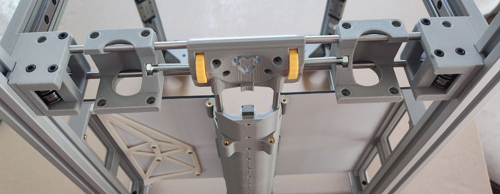

- Add the front of the clamp using M3x8 (4)
- Before you completely tighten the clamp, check Z1 is centered and square with the frame
- Tighten down the clamp and the Z1 Motor Mount
  - Note: later when we put the ebay tops on, you'll get an idea of well you did with centering

> [!NOTE]  
> At this point the Z1 rail should feel very rigid

## Belts

- Install the pulleys on the A and B motors, use a single bearing stack to help set the proper height
- Add the A and B motors to the rear moto mounts using M3x35 (4) and M3x8 (4)
  - Note: the motor wires should exit towards the side extrusion

  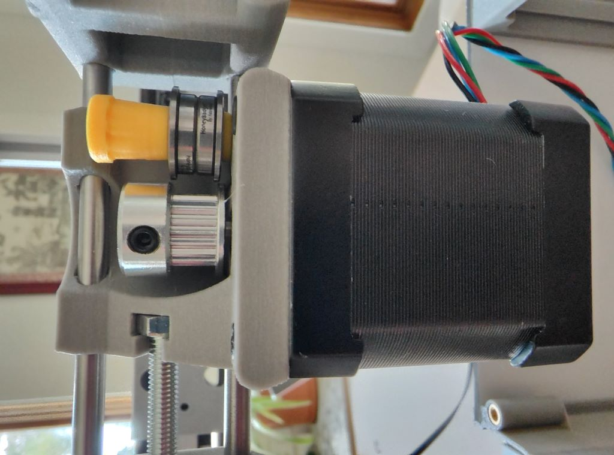
  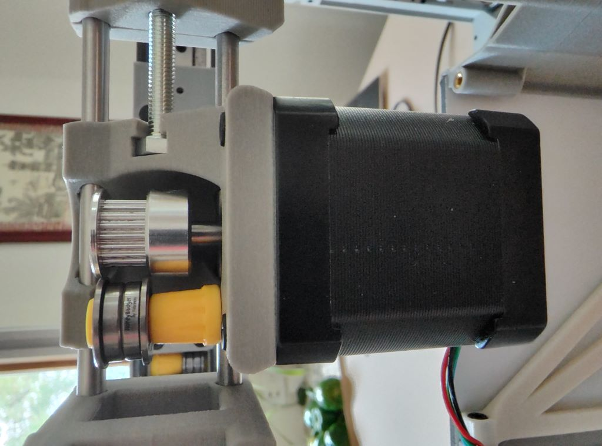

- At this point you are still missing some bearings in the rear and the XY joints, this will make routing easier
- Route the belts like any standard Core-XY machine (link to youtube here)
  - Summary: route one side, leaving some slack (try to account for missing bearings)
  - Pull belt out and cut second belt to exact length
  - Put both belts back in

  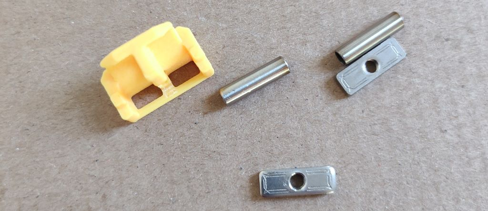

- Add the belts to clips using the 4mm OD and 3mm ID by 15mm long hollow tubes (2)
- Fasten the belts in the clips using M3x10 BHCS (2) and the Makerbeam XL rectangular nuts (2)

  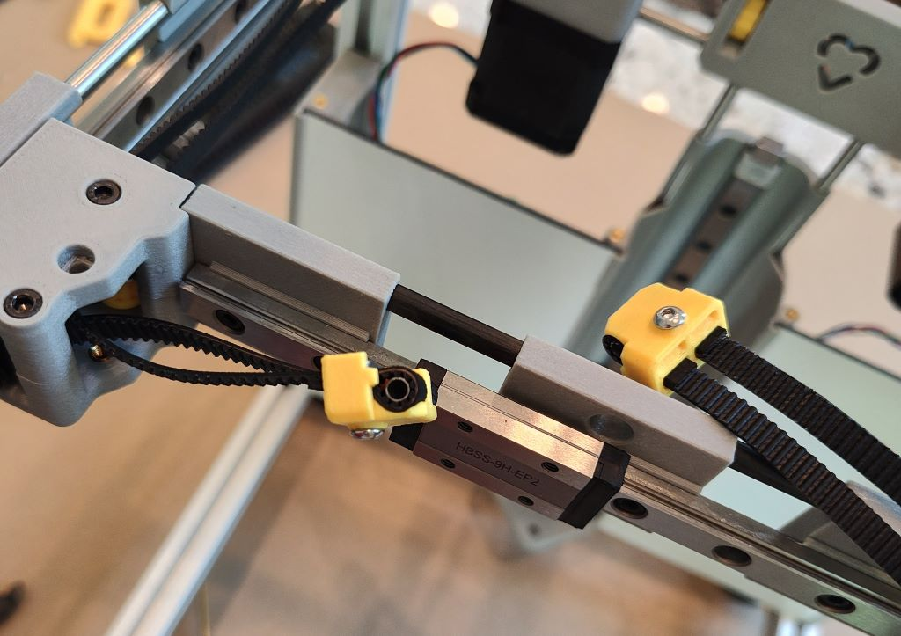

- Add in the missing single stack bearings in the XY joint and front of rear idler

### X-carriage

- Remove the supports from the magnet areas
- Add the 0.5x0.25x0.125" SmCo magnets (10), they should be a tight firm fit with zero wiggle room

> [!NOTE]  
> Make sure the polarity of each set of magnets are attracting together, otherwise you'll get poor hold

- Screw it on the X-carriage using M3x8 (4) screws
  - Note: I find the best print quality with a light tighten, too much and the carriage begins to rock
- Now clip in the belts using the (self-made) pins (2) or M3x35 (2) screws

### Tension belts and tramming

- Start tightening the belts using the knobs in the back
- Periodically check that all the belts are aligning on the bearings properly
- Keep tightening the belts and periodically pluck the back belts to check the tone
- Also, move the gantry as far back as possible
  - If there is an even gap behind both sides of the XY joints, you did a good job!

> [!IMPORTANT]  
> We will dial in the belt tension later using our ShakeTune

## Bed

- Turn the printer upside down
- Add the deck panel using the classic 3mm deck supports
- Mount all three integrated lead-screw motors using M3x6 (9)
- You can route the wires as you wish

  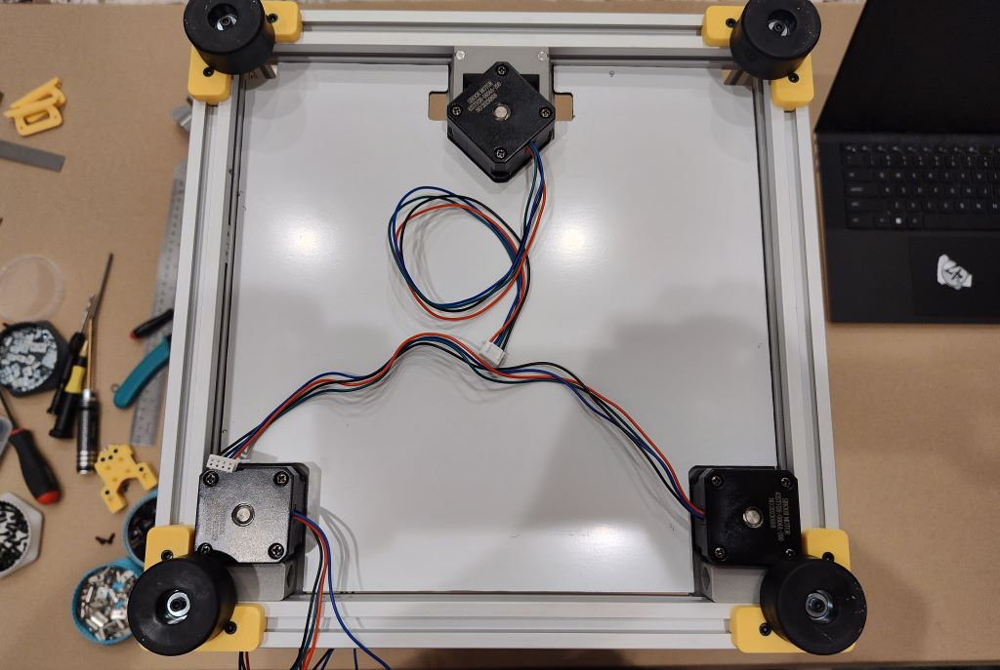

### Z Carriage Mounts

- Add M5x80mm (2) steel rods to mounts using your favorite hammer like tool
  - The rods should end up just barely touching the carriage so don't go too far
- Attach to rail using M3x8 (4)

> [!IMPORTANT]  
> The lead screw should be mostly centered when at the lowest position

- Next add POM nut, twist on and screw down using M3x8 (2)
- Test the up and down movement has no binding

### Kinematic Bed Mounts

- Add the SmCo or High-temp neodymium magnets (6) to carriers, it should be a tight fit so they stay put
- Optional when magnets aren't snug, add a screw to keep the magnets in place
- Slide onto the end of the 80mm steel rods closed end first

> [!IMPORTANT]
> You must use high-temp rated magnets or the bed won't hold-tight after multiple heat-cycles

### Bed Prep

- If your bed doesn't have integrated magnets, add the magnet sheet to the top of the bed
- Add the heater sheet to the underside of the bed
  - Note: pay attention to the routing of the wires doesn't interfere with the rear middle mount
- Use M4x10 (3) to screw on 10mm balls using 2 washers for spacing
- Test fit bed and check that it fits firmly in place with very little movement
  - The magnets should hold the bed firmly, even when upside down

> [!CAUTION]
> Not a problem, but a small amount of movement is normal if you yank on the bed

### Bed wiring

- Add some cable sleeve and route the wires thru the hole near the Z1 lead screw
- Allow enough slack for the bed to move the full range but not so much it catches on anything

## Electronics

> [!CAUTION]
> This build requires mains wiring, only proceed if you are certified to work with high voltages

### PSU

- For the thin PSU mount, add some 3mm thick foam between bracket and deck panel
- Add the PSU mounts using M3x8 for both brackets, tighten the second bracket after a test fit
- Mount the PSU to the bracket using M3x6 (2)

  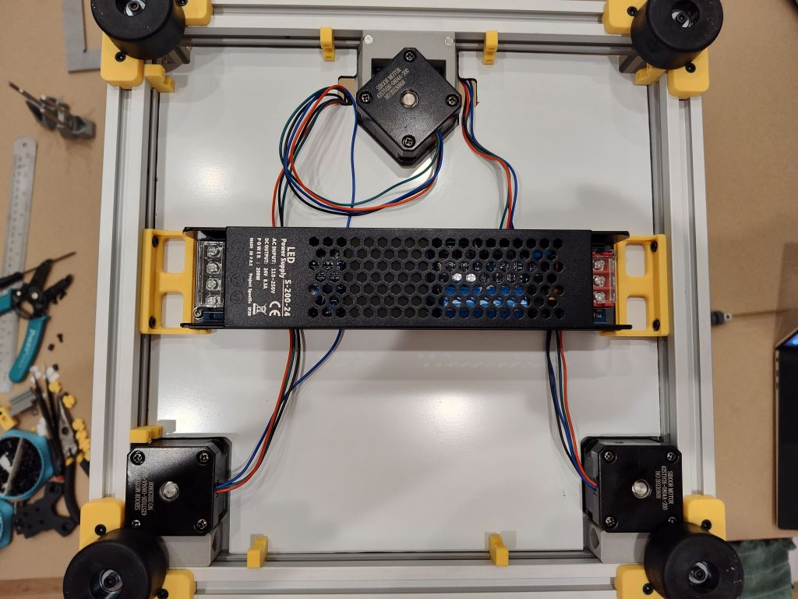

### Main Board

- Insert the E3EZ IO shield into the low voltage ebay mount
- Line the E3EZ ports up and mount using M3x6 (4)

### Mains Inlet

- Pre wire the mains inlet and then insert it into the mount, it should snap in
  - Don't forget to check that a fuse is installed
- Roll-in 2 tnuts and mount the mains inlet using M3x10 (2)
  - Grab the back panel and use for setting the perfect height

> [!CAUTION]
> Proceed to wire up Mini-V using Trident manual

## CAN Toolhead
