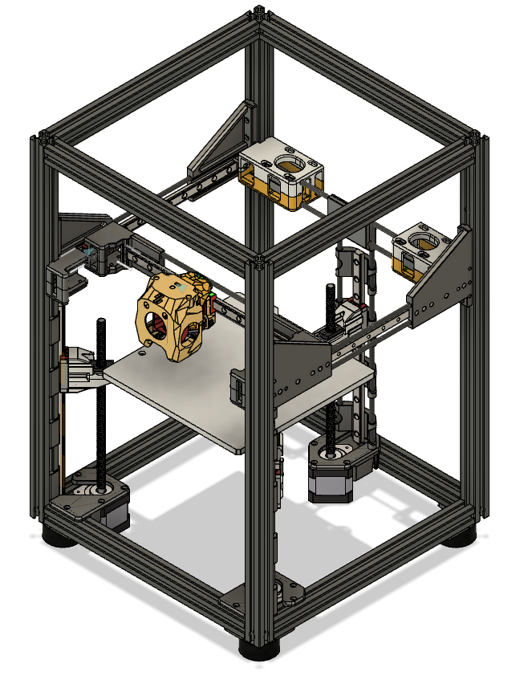

# Mini-V

Mini-V is a compact core-xy printer with a build volume of 180mm³ using 2020 extrusions. The printer is designed to maximize print volume with a minimal footprint.

<p align="center">
  
</p>

- Efficient build volume vs footprint
- Easy to build with 2020 extrusions
- Flush panel enclosure design
- Fold down tough door
- Lightweight and accurate z-probe (tap/boop)
- Automatic bed leveling
- Kinematic bed mount
- CAN based toolhead with dual 4010 part cooling
- Designed for E3EZ control board

## Footprint Comparison

| Printer       | Print Area | Footprint | Efficiency | Note
| ---           | ---        | ---       | ---        | ---
| **Mini-V**    | 180x180    | 360x360   | 50%        | Flush panels
| Tiny-T        | 150x150    | 370x370   | 40%        | With panels and clips on
| Salad Fork 160| 160x160    | ?         | ?          |
| Micron+       | 180x180    | ?         | ?          |
| Trident 250   | 250x250    | 426x426   | 58%        | Doesn't include air filter

## Frame Specs

```
So far, same as Tiny-T, you just need the uprights and top/bottom extrusions, 12 in total
```

## Components

- 6x Linear Rail MGN9H 220mm
- 180mm² or 185mm² MIC6 bed
- 180mm² PEI flex build plate
- 150mm² 300w AC heating pad and SSR
- Orbiter Extruder kit and Revo Voron (or your choice)
- 2x NEMA 17 XY stepper motor
- 3x Z Stepper motor with 200mm integrated lead screw
- 2x 150cm GATE 6mm GT2 open belt
- 3x Steel balls 10mm M4 threaded (must be magnetic)
- 6x Rectangular strip rare earth magnets 20x10x5mm 
- 2x 4010 24V blower fan (part cooling)
- 1x 3010 24V axial fan (hotend)
- 1x 4010 24V axial fan (electronics)
- 4x Rubber feet (amplifier)
- BTT E3EZ 5 stepper control board
- BTT EBB36 CAN toolhead board

## Pending Improvements

- Better Y mounts and screw locations
- 100% SHCS screws, only a few BHCS remain in this design
- Cross-bracing?
- Lighting
- Belt tension measurement notches
- AB motor improved tension design with captured nut

## Mods used


- [Boop](https://github.com/VoronDesign/VoronUsers/tree/master/printer_mods/Ellis/Single_MGN9H_Carriage) by `MasterMynd`
- [ProtoXtruder](https://github.com/nhchiu/VoronMods/blob/main/Extruders/ProtoXtruder/README.md) by `nhchui`
- [DragonBurner](https://github.com/chirpy2605/voron/tree/main/V0/Dragon_Burner) by `chirpy2605`
