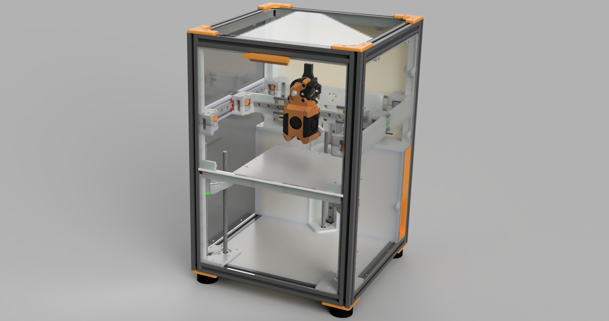
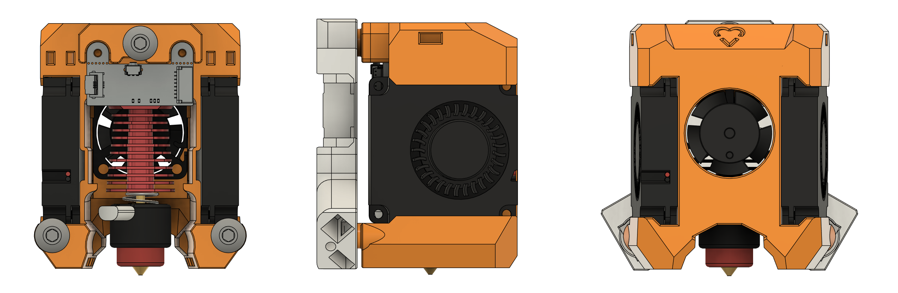

# Mini-V

Mini-V is a compact core-xy printer with a build volume of 180mm³ using 2020 extrusions. The printer is designed to maximize print volume with a minimal footprint.

_October 2024 Update: We gathered a ton of great feedback from the Mini-V Group Build in Reno at VICE 2024. We have multiple builders sending in tips and feedback. We also now have full assembly CAD and a build guide available. Enjoy!_

  

- Easy to build 2020 box design ✅
- Super light carbon fiber rod backed X rail ✅
- Sleek flush panels enclosure ✅
- Quick access electronics and host ports ✅
- Fold-down door and easy to remove top panel ✅
- Consistently perfect first layers with Boop ✅
- Automatic bed leveling ✅
- Easy belt tensioning knobs ✅
- Hi-temp dual-mag tri-mount stay-put kinematic bed 😅 ✅
- Magnetic toolhead with dual 4010 part cooling ✅
- Extra headroom for umbilical/PTFE tube ✅
- Dedicated high-voltage and low-voltage areas ✅
- No drag chains ✅
- Mostly M3 SHCS and easy to source hardware ✅
- Toolchanger ready! ↔️

Prototype build log on Discord here: #"jv's Mini-V a custom compact 180³ build using 2020 and CF rods"

- [Specs](./docs/Specs.md) for detailed specifications
- [BOM](./docs/BOM.md) for bill of materials
- [Printing Parts](./docs/PrintingParts.md) for slicer settings and print tips
- [Build Guide](./docs/BuildGuide.md) for step-by-step build instructions
- [Startup Config](./docs/StartupConfig.md) for Klipper configuration and startup routine
- [RepRap History](./docs/RepRapHistory.md) for how this open source printer evolved
- [TODO](./docs/TODO.md) for remaining design areas

## Community Design

Custom magnetic Yavoth toolhead mod with integrated PZ board mount:

  

Although Mini-V is almost a completely custom design, it does utilize the following community designs:

- [Yavoth Toolhead](https://github.com/chirpy2605/voron) by `chirpy2605`
- [Belt Clips](https://github.com/zruncho3d/vampire_bat) by `zruncho3d`
- Inspiration from Voron Trident and is derived from Tiny-T frame dimensions
