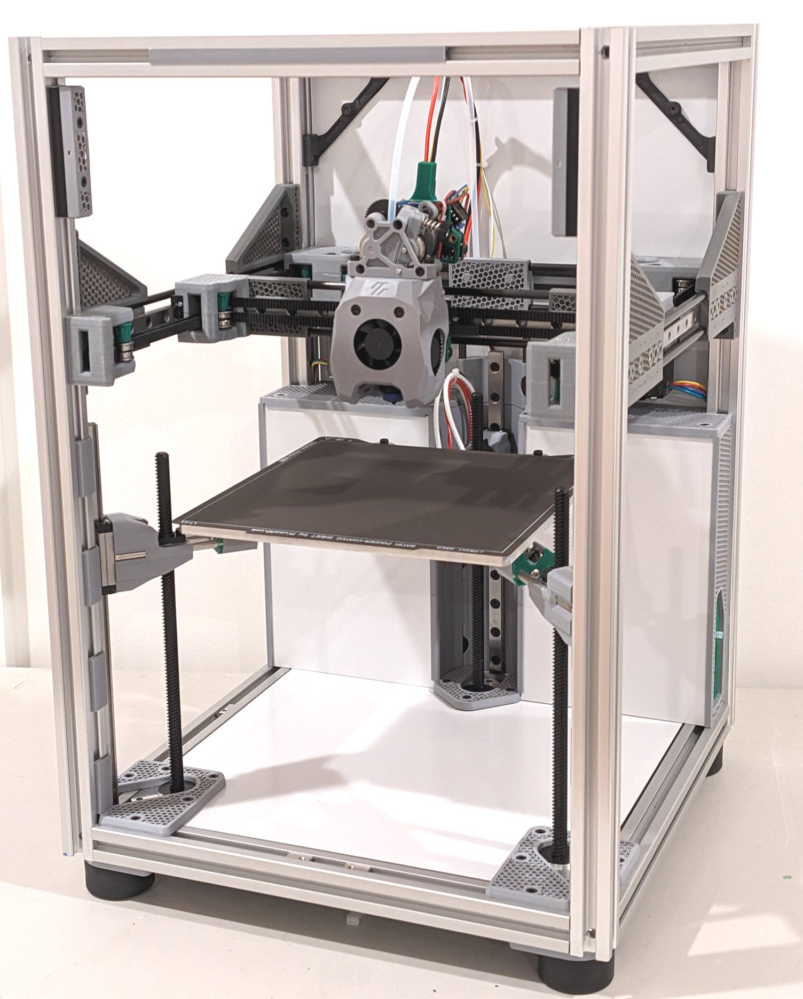
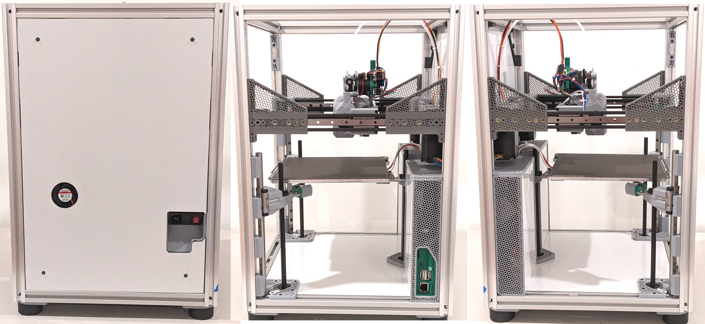

# Mini-V

Mini-V is a compact core-xy printer with a build volume of 180mm³ using 2020 extrusions. The printer is designed to maximize print volume with a minimal footprint.

  
  

- Easy to build 2020 box design ✅
- Super light carbon fiber rods ✅
- Sleek flush panels enclosure ✅
- Quick access electronics and host ports ✅
- Fold-down door and removable mag panels ✅
- Consistently perfect first layers with Boop
- Automatic bed leveling ✅
- Easy belt tensioning
- Hi-temp Dual-mag Tri-mount Stay-put kinematic bed 😅 ✅
- CAN based toolhead with dual 4010 part cooling ✅
- Extra headroom for umbilical/PTFE tube ✅
- Dedicated high-voltage and low-voltage areas ✅
- No drag chains ✅
- Designed for E3EZ control board ✅
- Mostly M3 SHCS and easy to source hardware ✅

## Footprint Comparison

| Printer         | Frame | Print Area | Footprint | Efficiency | Note
| ---             | ---   | ---        | ---       | ---        | ---
| **Mini-V**      | 2020  | 180x180    | 360x360   | 50%        | Flush panels
| Tiny-T          | 2020  | 150x150    | 370x370   | 40%        | With panels and clips on
| SaladFork       | 1515  | 160x160    | ?         | ?          |
| Micron+         | 1515  | 180x180    | ~360x360  | 50%        | Same footprint, shorter due to less Z
| Trident         | 2020  | 250x250    | 426x426   | 58%        | Doesn't include air filter

Build log here: #"jv's Mini-V a custom compact 180³ build using 2020 and CF rods"

## Manual

There is no manual available yet but please check the [Build Steps](https://github.com/jarrettv/Mini-V/blob/main/docs/Build_Steps.md)

## Pending Improvements

* Wago mounts
* Bottom panel (as recommended by SteveBuilds)
* E-bay cooling flow one side to other
* Redesign side panels and ebay sides (less plastic)
* 2 hump on Y (measured with EBB toolhead)
* Replace neodymium magnets under bed with samarian cobalt magnets
* Replace boop with under bed piezo sensor?

## Major BOM Components

- 4x Misumi HFSB5-2020-430-LCP-RCP-AV260 corner extrusions
- 7x Misumi HFSB5-2020-270-TPW top and bottom extrusions
- 12x Carbon Fiber Rod 5mm Ø by 270mm long
- 6x Metal Rod 5mm Ø by 80mm long
- 6x Linear Rail MGN9H 220mm
- 180mm² or 185mm² MIC6 bed
- 180mm² PEI flex build plate
- 150mm² 300w AC heating pad and SSR
- Extruder of your choice (LGX-lite, Orbiter2, Galileo2)
- Hotend of your choice (Revo or Rapido2)
- 2x NEMA 17 XY stepper motor
- 3x Z Stepper motor with 200mm integrated lead screw (220mm perferred)
- 2x 150cm GATE 6mm GT2 open belt
- 3x Steel balls 10mm M4 threaded (must be magnetic)
- 6x Rectangular high-temp magnets 20x10x5mm
- 4x F623-RS Bearings (guidelers)
- 24x F695 Bearings
- 2x 4010 24V blower fan (part cooling)
- 1x 3010 24V axial fan (hotend)
- 1x 4010 24V axial fan (electronics)
- 4x Rubber feet (amplifier)
- BTT E3EZ 5 stepper control board
- BTT EBB36 CAN toolhead board

## Adopted Mods
Although Mini-V is almost a completely custom design, it does utilize the following community designs:

- [Boop](https://github.com/PrintersForAnts/Boop) by `MasterMynd` 
- [DragonBurner](https://github.com/chirpy2605/voron/tree/main/V0/Dragon_Burner) by `chirpy2605`
